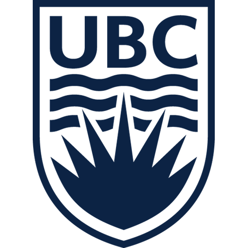

## Portfolio

---

### Projects

[Pose and Appearance Disentanglement](/PoseAppDisentanglement)

---
[Dance Motion Transfer](/DanceMotion)

---
[Text to Image](/Text2Img)

---
[Fake News Detection](http://example.com/)

---

### Education

<table width="100%" align="center" border="0" cellpadding="20"><tbody>
          <tr>
            <td style="padding:20px;width:20%;vertical-align:middle"></td>
            <td width="75%" valign="center">
              <b><a href="http://www.cs.ubc.ca//">University of British Columbia</a></b>
               
              M.Sc. in Computer Science  
                      Supervisors: <a href="http://www.cs.ubc.ca/~little/">Jim Little</a>, <a href="http://www.cs.ubc.ca/~rhodin/">Helge Rhodin</a>
            </td>
          </tr>
             
<table width="100%" align="center" border="0" cellpadding="20"><tbody>
          <tr>
            <td style="padding:20px;width:20%;vertical-align:middle"></td>
            <td width="75%" valign="center">
              <b><a href="http://ce.sharif.edu//">Sharif University of Technology</a></b>
               
              B.Sc. in Computer Engineering
            </td>
          </tr>

---

---

Page template forked from <a href="https://github.com/evanca/quick-portfolio">evanca</a>

<!-- Remove above link if you don't want to attibute -->
